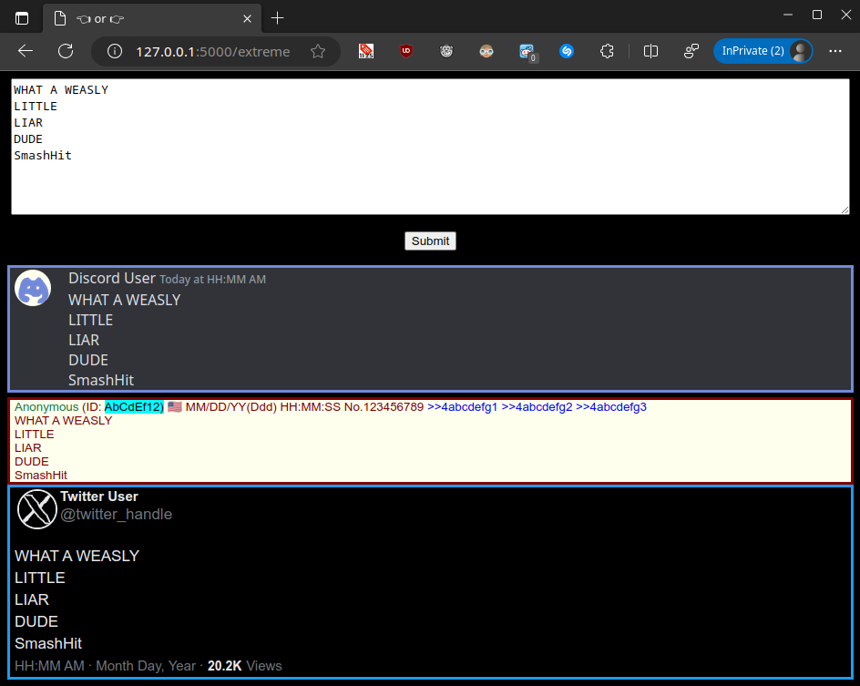

# ExtremeLeftOrRight

Let's play a game, is this message from the extreme left or the extreme right?

Message preview for:
- Discord
- /pol/
- X (formerly Twitter)



## Setup

### Make venv

```bash
python -m venv venvbamna
```
### Activate venv (where `<venv>` = venvbamna)

Platform | Shell | Command to activate virtual environment
---|---|---
POSIX | bash/zsh | $ source `<venv>`/bin/activate
POSIX | fish | $ source `<venv>`/bin/activate.fish
POSIX | csh/tcsh | $ source `<venv>`/bin/activate.csh
POSIX | PowerShell | $ `<venv>`/bin/Activate.ps1
Windows | cmd.exe | C:\> `<venv>`\Scripts\activate.bat
Windows | PowerShell | PS C:\> `<venv>`\Scripts\Activate.ps1

### Install requirements

- the only real requirement:

`pip install flask`

- or for the last tested version

`pip install -r requirements.txt`

### Run local debug instance

`flask run --debug`

### Open Web UI

open:
- [127.0.0.1:5000](127.0.0.1:5000)
- or directly to [127.0.0.1:5000/extreme](127.0.0.1:5000/extreme) in a browser

### Real deployment

For a real deployment read a flask guide, use something like **gunicorn** maybe.

https://flask.palletsprojects.com/en/2.3.x/deploying/
